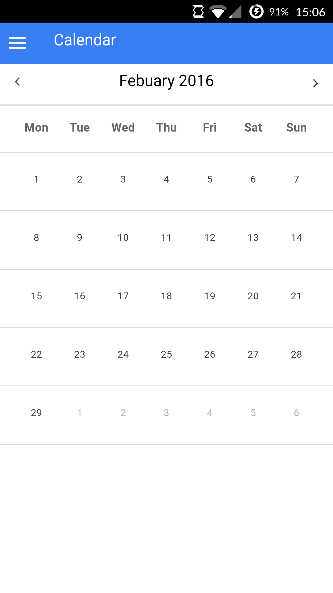
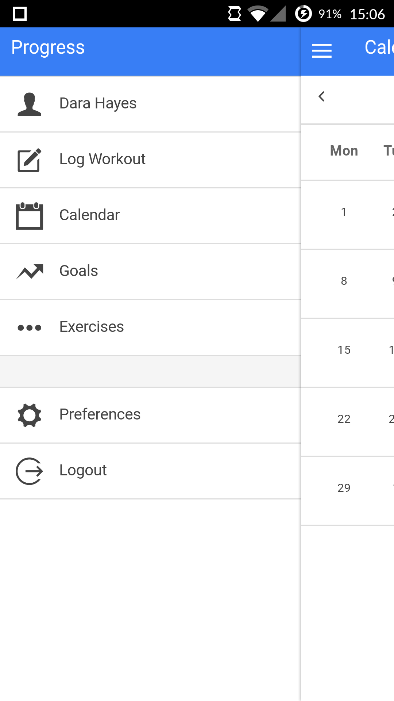
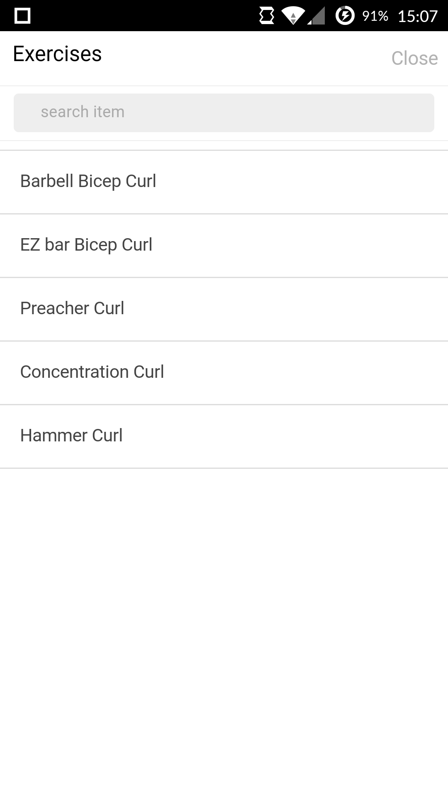
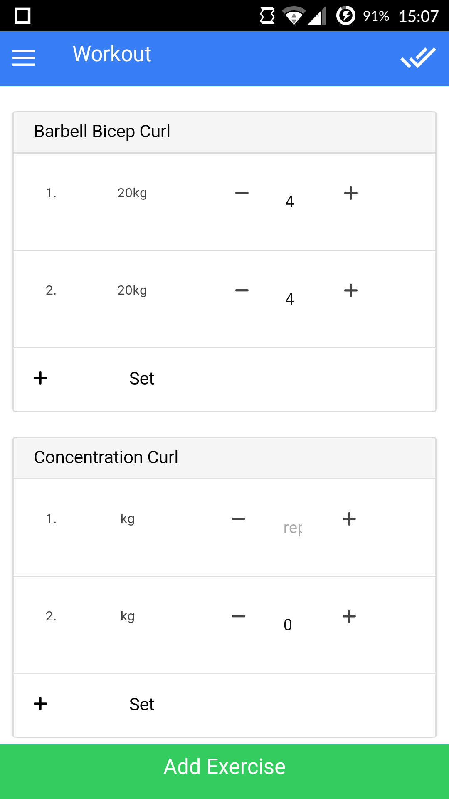

#Progress
A mobile workout logging application built with [Ionic.][ionic] Talks back to the [progress-api][progress-api]

This is a work in progress and it's just getting started. 
It's my first experience ever using Angular or Ionic.
It's quite a learning exercise.

##Setup
First, install Ionic & Cordova

```bash
npm install -g cordova ionic
```

Then clone this project.

```bash
git clone https://darragh-hayes/progress-app
```

###Install dependencies

```bash
npm install
bower install
```

###Run in the browser

```bash
ionic serve
```

###Run using phonegap developers app
Ensure the phonegap cli is installed:
```bash
npm install -g phonegap
```

Run it using:

```bash
phonegap serve
```

This will make it available through the phonegap developers app.


##Screenshots





#License
This software is free to copy and redistribute under the [GNU General Public License v3.0](./License.md). 

© Darragh Hayes 2016


[ionic]: http://ionicframework.com/
[progress-api]: https://github.com/darragh-hayes/progress-api